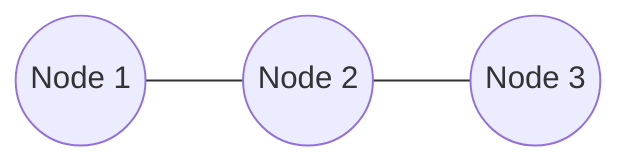

# Graph Neural Networks (GNNs)

## 1. Motivation & Intuition

### Why do we need Graph Neural Networks?
Most traditional machine learning models (like Linear Regression, Random Forests, or Standard Neural Networks) assume that data instances are **independent** of one another. For example, if you are classifying images of cats, the content of Image A does not typically depend on Image B.

However, in the real world, data is often **relational**. Entities are connected, and these connections contain vital information:
* **Social Networks:** Your interests are likely similar to your friends' interests.
* **Molecules:** Atoms interact based on chemical bonds; a molecule's toxicity depends on its structure, not just a bag of atoms.
* **Citation Networks:** A paper's topic is strongly correlated with the papers it cites.

### The Problem with Standard Neural Networks on Graphs
If you try to feed a graph into a standard Feed-Forward Neural Network (MLP), you face two fundamental issues:
1. **Variable Size:** Graphs have different numbers of nodes. An MLP requires a fixed input vector size.
2. **Permutation Invariance:** In a graph, the "order" of nodes is arbitrary. If you swap Node A and Node B in your input matrix but keep their connections identical, the underlying graph hasn't changed. A standard MLP would treat this as a completely different input and output a different prediction.

### The Solution: The "Neighborhood" Intuition
GNNs solve this by borrowing a core concept from Convolutional Neural Networks (CNNs). In a CNN, a pixel learns its representation from its spatial surrounding pixels. In a GNN, a node learns its representation from its **graph neighbors**.

Imagine you are a node in a social network. To predict your hobbies, the network looks at:
1. **Your own features:** Age, occupation, location.
2. **Your friends' features:** If 80% of your friends play tennis, you statistically likely play tennis too.
3. **Your local topology:** Are you a bridge between two separate friend groups, or part of a tight clique?

A GNN operates as a multi-round message-passing system. In every layer, every node packages its current feature state into a "message" and broadcasts it to its neighbors. Nodes collect these incoming messages, aggregate them, and update their own state.

---

## 2. Conceptual Foundations

### Key Definitions
* **Graph ($G$):** A mathematical structure consisting of a set of **Nodes** (vertices) $V$ and a set of **Edges** (links) $E$.
* **Node Feature Matrix ($X$):** A matrix of dimension $N \times F$, where $N$ is the total number of nodes and $F$ is the number of input features per node. Row $i$ contains the features for node $i$.
* **Adjacency Matrix ($A$):** A square $N \times N$ matrix representing connections. If an edge exists between node $i$ and node $j$, $A_{ij} = 1$; otherwise $A_{ij} = 0$.
* **Neighborhood ($\mathcal{N}(u)$):** The explicit set of all nodes directly connected to node $u$ via an edge.

### The Message Passing Framework
Modern spatial GNNs operate on a standardized 3-step per-layer cycle:

1. **Message:** Every node $v \in \mathcal{N}(u)$ generates a message vector based on its current hidden state.
2. **Aggregation:** Node $u$ collects the messages from all $v \in \mathcal{N}(u)$ and compresses them into a single vector. This function **must be permutation invariant** (the order in which neighbors "speak" cannot change the output). Standard choices are $\text{SUM}$, $\text{MEAN}$, or $\text{MAX}$.
3. **Update:** Node $u$ takes its own prior state and combines it with the newly aggregated neighborhood vector to produce its updated representation for the next layer.

### Core Downstream Tasks
* **Node-Level:** Predict an attribute for individual nodes (e.g., *Categorical: Is this specific account a spam bot?*)
* **Edge-Level:** Predict properties of connections or test for missing links (e.g., *Link Prediction: Will User A send a friend request to User B?*)
* **Graph-Level:** Pool all node embeddings together to classify the entire topology (e.g., *Regression: What is the solubility of this generated protein?*)

---

## 3. Mathematical Formulation

Let $h_u^{(k)}$ represent the hidden feature vector of node $u$ at layer $k$. We define the base input state as $h_u^{(0)} = X_u$.

### General Message Passing Equation
For any given node $u$, the representation update at layer $k+1$ is generalized as:

$$
h_u^{(k+1)} = \text{UPDATE}^{(k)} \left( h_u^{(k)}, \, \text{AGGREGATE}^{(k)} \left( \left\{ h_v^{(k)}, \, \forall v \in \mathcal{N}(u) \right\} \right) \right)
$$

### Spectral Methods: Graph Convolutional Networks (GCN)
Kipf & Welling (2017) derived the first-order approximation of localized spectral graph convolutions, resulting in the standard **GCN propagation rule**:

$$
H^{(k+1)} = \sigma \left( \tilde{D}^{-\frac{1}{2}} \tilde{A} \tilde{D}^{-\frac{1}{2}} H^{(k)} W^{(k)} \right)
$$

Breaking down the mechanics of this operation:
* $H^{(k)}$: The $N \times F$ matrix of all node features at layer $k$.
* $W^{(k)}$: A learnable weight transformation matrix shared across all nodes.
* $\tilde{A} = A + I_N$: The adjacency matrix modified with **self-loops** (the identity matrix $I_N$ added to $A$). Without self-loops, a node would aggregate its neighbors' features but drop its own previous identity.
* $\tilde{D}$: The degree matrix of $\tilde{A}$, where $\tilde{D}_{ii} = \sum_j \tilde{A}_{ij}$.
* $\tilde{D}^{-\frac{1}{2}} \tilde{A} \tilde{D}^{-\frac{1}{2}}$: **Symmetric Normalization**. If we used raw summation ($\tilde{A}H$), high-degree nodes (celebrities in a network) would result in exploding feature values simply because they summed more inputs. Symmetric normalization scales the incoming message from node $j$ to node $i$ by $\frac{1}{\sqrt{\text{deg}(i)\text{deg}(j)}}$.

### Spatial Methods

#### 1. GraphSAGE (Sample and Aggregate)
GraphSAGE decouples the graph structure from the computation graph by introducing **neighborhood sampling** to bound compute time:

$$
h_{\mathcal{N}(u)}^{(k+1)} = \text{AGGREGATE}_k \left( \left\{ h_v^{(k)}, \, \forall v \in \mathcal{N}_{sample}(u) \right\} \right)
$$

$$
h_u^{(k+1)} = \sigma \left( W^{(k)} \cdot \left[ h_u^{(k)} \,||\, h_{\mathcal{N}(u)}^{(k+1)} \right] \right)
$$

*(Where $||$ denotes vector concatenation).*

#### 2. Graph Attention Networks (GAT)
GAT replaces static structural normalization with **learned anisotropic attention weights**. The network learns which neighbors are most relevant to a specific node:

$$
h_u^{(k+1)} = \sigma \left( \sum_{v \in \mathcal{N}(u)} \alpha_{uv} W h_v^{(k)} \right)
$$

The attention coefficient $\alpha_{uv}$ is computed explicitly via a softmax over a shared single-layer feedforward network parameterized by weight vector $\mathbf{a}$:

$$
\alpha_{uv} = \frac{\exp\left(\text{LeakyReLU}\left(\mathbf{a}^T \left[ W h_u \,||\, W h_v \right]\right)\right)}{\sum_{k \in \mathcal{N}(u)} \exp\left(\text{LeakyReLU}\left(\mathbf{a}^T \left[ W h_u \,||\, W h_k \right]\right)\right)}
$$

---

## 4. Worked Example: A Single GCN Layer

Consider an undirected graph containing 3 nodes connected in a simple line sequence:

**Goal:** Compute the updated representation for **Node 2** after 1 layer of Graph Convolution.

#### 1. Define Initial States
Assume 1-dimensional scalar features for simplicity: Node 1 has value `1`, Node 2 has `2`, Node 3 has `3`.

$$
A = \begin{bmatrix} 0 & 1 & 0 \\ 1 & 0 & 1 \\ 0 & 1 & 0 \end{bmatrix}, \quad H^{(0)} = \begin{bmatrix} 1 \\ 2 \\ 3 \end{bmatrix}
$$

#### 2. Add Self-Loops ($\tilde{A}$)

$$
\tilde{A} = A + I = \begin{bmatrix} 1 & 1 & 0 \\ 1 & 1 & 1 \\ 0 & 1 & 1 \end{bmatrix}
$$

#### 3. Compute Degree Matrix ($\tilde{D}$)
Summing the rows of $\tilde{A}$ gives degrees: $\text{deg}(1)=2, \, \text{deg}(2)=3, \, \text{deg}(3)=2$.

$$
\tilde{D} = \begin{bmatrix} 2 & 0 & 0 \\ 0 & 3 & 0 \\ 0 & 0 & 2 \end{bmatrix}
$$

#### 4. Compute Symmetric Normalization ($\hat{A} = \tilde{D}^{-1/2} \tilde{A} \tilde{D}^{-1/2}$)
Each entry $(i, j)$ in $\tilde{A}$ is multiplied by $\frac{1}{\sqrt{\text{deg}(i)\text{deg}(j)}}$:

$$
\hat{A}_{2,1} = \frac{1}{\sqrt{3 \times 2}} \approx 0.408, \quad \hat{A}_{2,2} = \frac{1}{\sqrt{3 \times 3}} = 0.333, \quad \hat{A}_{2,3} = \frac{1}{\sqrt{3 \times 2}} \approx 0.408
$$

#### 5. Execute Neighborhood Aggregation ($\hat{A} H^{(0)}$)
Extracting the row for Node 2:

$$
\text{Aggregated}_2 = (0.408 \times 1) + (0.333 \times 2) + (0.408 \times 3) = 0.408 + 0.666 + 1.224 = \mathbf{2.298}
$$

#### 6. Apply Weights and Activation
Assuming a learned scalar weight $W^{(0)} = 0.5$ and a standard $\text{ReLU}$ activation:

$$
h_2^{(1)} = \max(0, \, 2.298 \times 0.5) = \mathbf{1.149}
$$

---

## 5. Relevance to Machine Learning Practice

### When to Deploy GNNs
* **High Graph Homophily:** The target label strongly correlates with local neighborhood connectivity.
* **Non-Euclidean Spatial Geometry:** The structural arrangement carries physics/chemistry domain rules (e.g., benzene rings in pharmacology).

### Production Use Cases
1. **Computational Biology & Drug Discovery:** Atoms act as nodes, atomic bonds act as edges. Predicting molecular toxicity via GNN outperforms SMILES string parsing because it naturally respects 3D rotational invariance.
2. **Web-Scale Recommendation Systems (Pinterest / Uber Eats):** Formulated as bipartite graphs connecting Users to Items. GraphSAGE generates item embeddings by aggregating the visual/textual features of historically co-purchased neighboring items.
3. **Traffic Flow & ETA Forecasting (Google Maps):** Road intersections act as nodes; road segments act as edges. The GNN models how a traffic bottleneck at Node A cascades downstream to adjacent connected roads over time.

### System Trade-Offs
* **Memory Bottlenecks:** Standard GCN is a *full-batch* algorithm; the entire normalized $N \times N$ matrix must reside in GPU memory. This fails on networks with >10M nodes, forcing engineers to adopt inductive mini-batching frameworks (GraphSAGE / Cluster-GCN).
* **The Oversmoothing Limit:** Stacking standard deep neural networks improves expressive power. Stacking GNNs beyond 4–6 layers causes all node embeddings to converge to the exact same uniform vector, rendering the network useless.

---

## 6. Common Pitfalls & Misconceptions

1. **Assuming GNNs solve long-range graph problems:** GNNs act as local message passers. If Node A requires information from Node B located 12 hops away, a 3-layer GNN is mathematically incapable of passing that signal.
2. **Forcing graphs onto tabular data:** If edge creation is arbitrary (e.g., connecting customers based on fuzzy logic just to force a GNN architecture), an XGBoost model trained strictly on flat node features will routinely outperform the GNN.
3. **Target Leakage in Link Prediction:** When predicting whether Edge $(A, B)$ exists, that edge **must be deleted** from the input adjacency matrix $A$ during the forward pass. If left in, the GNN simply reads its existence directly from the input tensor.

---

## 7. Interview Preparation Section

### Foundational Questions

**Q1: What fundamental mathematical property must a GNN aggregation operator possess, and why?**
> **Answer:** It must be **permutation invariant**. In Euclidean grids (images), pixel $(x+1, y)$ is strictly to the right of $(x, y)$. In graph structures, the set of neighbors $\mathcal{N}(u) = \{v_1, v_2, v_3\}$ has no inherent spatial ordering. Whether the computer stores the neighbor list as `[v1, v2, v3]` or `[v3, v1, v2]`, the aggregation operator (e.g., $\text{SUM}$) must output the exact same compressed vector.

**Q2: What is the difference between Transductive and Inductive GNN learning frameworks?**
> **Answer:** > * **Transductive (e.g., GCN):** The model requires the entire graph topology during training. It learns embeddings tied directly to explicit node IDs. It cannot generate an embedding for a brand new node added to the network tomorrow without running a full re-train.
> * **Inductive (e.g., GraphSAGE / GAT):** The model does not learn static node embeddings; it learns generalized *aggregator function weights*. It can be trained on Graph A (e.g., a synthetic protein network) and immediately run inference on a completely unseen Graph B.

---

### Mathematical Questions

**Q3: Derive why row-normalization ($\tilde{D}^{-1}\tilde{A}$) can cause instability in graphs with skewed degree distributions compared to symmetric normalization ($\tilde{D}^{-1/2}\tilde{A}\tilde{D}^{-1/2}$).**
> **Answer:** Under standard row normalization, the message passed from node $j$ to node $i$ is scaled strictly by $\frac{1}{\text{deg}(i)}$. If node $j$ is a high-degree "hub" node connected to 10,000 nodes, it blasts its full un-scaled feature magnitude into every single low-degree neighbor it connects to, completely washing out their local feature spaces. Symmetric normalization divides the weight by $\sqrt{\text{deg}(i)\text{deg}(j)}$, penalizing the outgoing broadcast volume of massive hub nodes while preserving the unit scale of the feature variance.

**Q4: What is the parameter complexity of a single GCN layer mapping an input feature space $F_{in}$ to $F_{out}$ on a graph with $N$ nodes and $E$ edges?**
> **Answer:** $\mathcal{O}(F_{in} \times F_{out})$ (plus an optional bias vector of size $F_{out}$). Crucially, **the parameter count is completely independent of $N$ and $E$**. The adjacency matrix acts purely as a routing operator for the matrix multiplication; the only parameters adjusted via backpropagation reside inside the shared projection matrix $W$.

---

### Applied Scenario Questions

**Q5: You are tasked with detecting fraudulent accounts on a peer-to-peer payment network containing 150 million nodes. Fraud accounts represent 0.02% of the graph. Walk through your high-level architecture decisions.**
> **Answer:**
> 1. **Architecture:** Reject standard GCN due to GPU VRAM limits. Deploy **GraphSAGE** utilizing random neighborhood fan-out sampling (e.g., sampling $S_1=15$ immediate neighbors, and $S_2=10$ second-hop neighbors per target node).
> 2. **Aggregator Choice:** Utilize a **Mean or Max-Pool aggregator**. Avoid static summation aggregators as transaction volumes per user vary wildly.
> 3. **Class Imbalance:** Apply **Focal Loss** or heavy class-weighted Cross-Entropy. Implement *biased neighborhood sampling* during training batches to ensure fraudulent nodes are over-sampled as anchor seeds.
> 4. **Feature Engineering:** Combine static node attributes (account age, KYC status) with temporal edge features (transaction velocity, timestamp diffs).

---

### Debugging & Failure Modes

**Q6: You train a 12-layer GNN. Your training loss plateaus immediately, and upon inspection, the cosine similarity between any two random node embeddings in the network is $0.999$. Diagnose the failure.**
> **Answer:** The network is suffering from **Oversmoothing**. 
> Mathematically, multiplying a feature matrix repeatedly by a normalized Markov-like adjacency operator acts as a Laplacian smoothing filter. As layer depth $k \to \infty$, every node's feature vector asymptotically converges to the dominant eigenvector of the graph (the network's stationary distribution). 
> * **Remediation:** Cut the architecture down to 2–4 layers. If deep receptive fields are strictly required, implement **Jumping Knowledge Networks (JK-Net)** to skip-concatenate intermediate layer representations directly into the final projection head.

**Q7: You deploy a Graph Attention Network (GAT). During validation inspection, you log the attention weights $\alpha_{ij}$ across several nodes and discover they are entirely uniform across all neighbors ($\alpha_{ij} \approx \frac{1}{\text{deg}(i)}$). What has broken?**
> **Answer:** The attention mechanism has degenerated into a standard unweighted mean-aggregator. This occurs due to three primary failure modes:
> 1. **Uninformative Node Features:** If the input feature space $X$ lacks expressive variance, the attention projection $\mathbf{a}^T [Wh_i || Wh_j]$ evaluates to roughly the same scalar value for all pairs.
> 2. **LeakyReLU Saturation:** The negative slope of the attention activation may be poorly initialized, causing gradient die-off during the softmax calculation.
> 3. **High Homophily Triviality:** The local neighborhood is so structurally identical that the network determines differential weighting yields no optimization benefit over uniform averaging.